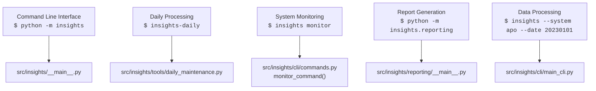
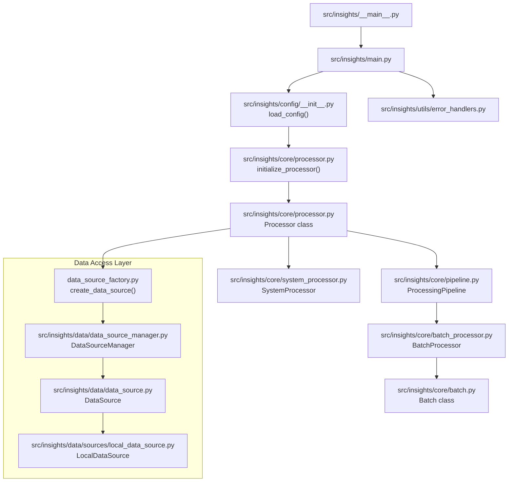
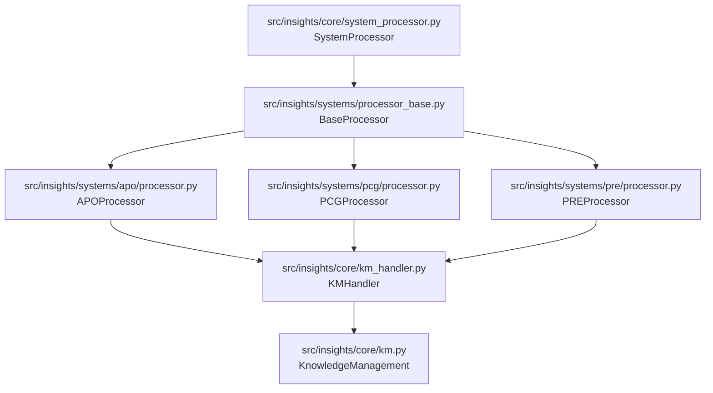
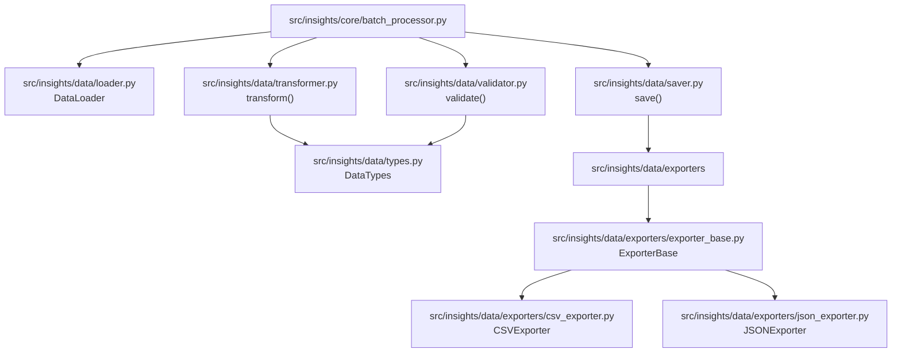
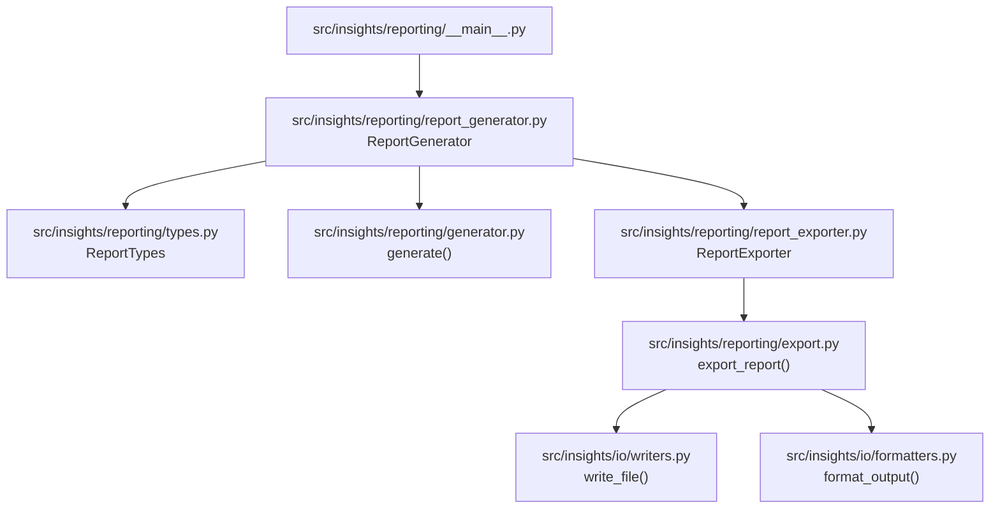
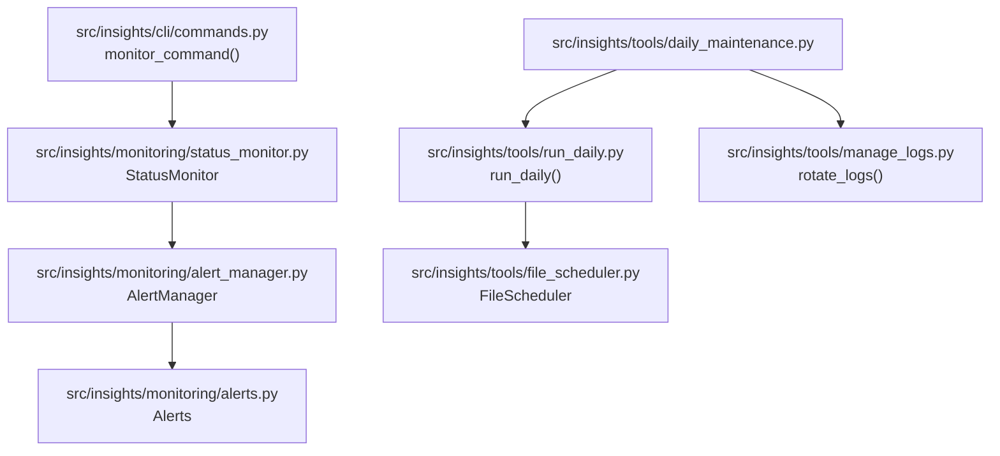
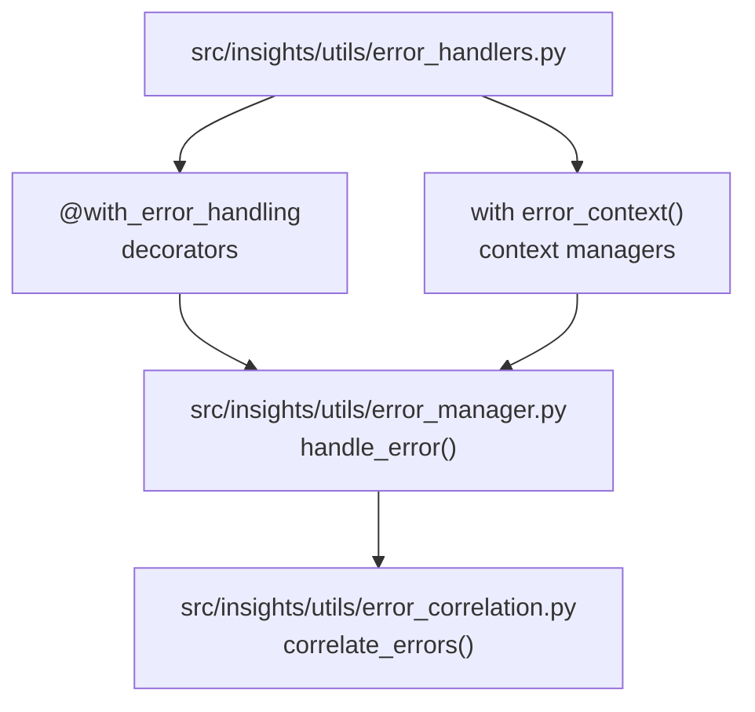
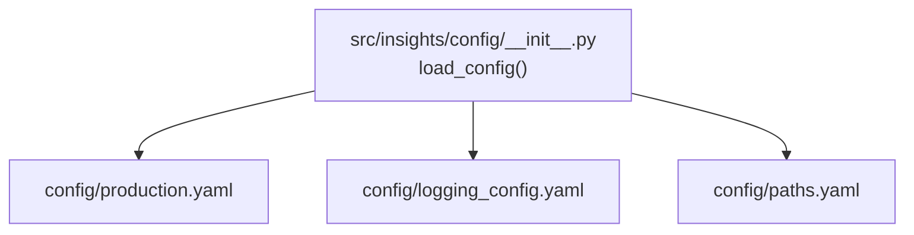
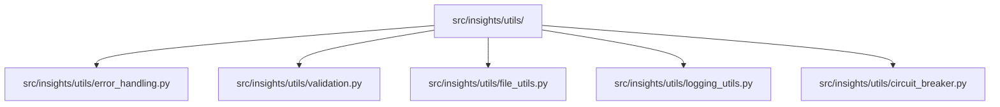

# Travelport Insights Production Flow Chart

This document provides a flow chart of the production execution paths in Travelport Insights, showing command execution, module dependencies, and processing flows.

## Entry Point Commands



## Main Application Flow



## System-Specific Processing



## Data Transformation and Validation



## Reporting and Output Generation



## Monitoring and Maintenance



## Error Handling Flow



## Production Execution Examples

### Daily Processing Workflow

1. System automatically executes the daily processing job:
   ```bash
   insights-daily
   ```

2. The `daily_maintenance.py` module loads and executes:
   - Rotating log files
   - Cleaning temporary files
   - Running the scheduler for file operations

3. The system then executes the main processing for each system:
   ```bash
   python -m insights --system apo --date yesterday
   python -m insights --system pcg --date yesterday
   python -m insights --system pre --date yesterday
   ```

4. Each processing job:
   - Loads the appropriate configuration
   - Initializes the core processor
   - Creates the processing pipeline
   - Loads data from the appropriate sources
   - Processes data in batches
   - Applies knowledge management rules
   - Saves outputs to the configured locations

5. After processing, generates reports:
   ```bash
   python -m insights.reporting --type daily
   ```

6. Finally, performs health checks:
   ```bash
   python scripts/health_check.py
   ```

## Configuration Dependencies

All modules depend on the configuration subsystem:



## Key Utilities Used Throughout the System



## Notes on Production Module Flow

- The entry points shown are the primary production execution paths
- All modules are connected through the central configuration system
- Error handling is pervasive throughout all modules using the standard framework
- Data flows from sources through processors and transformers to exporters
- System-specific processors inherit from the base processor but implement custom logic
- The monitoring subsystem runs in parallel to the main processing flow
- Maintenance tools operate on a schedule to ensure system health
